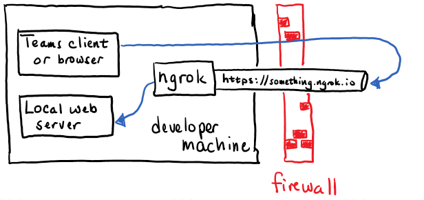
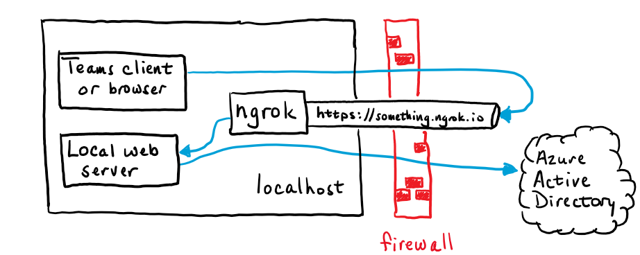
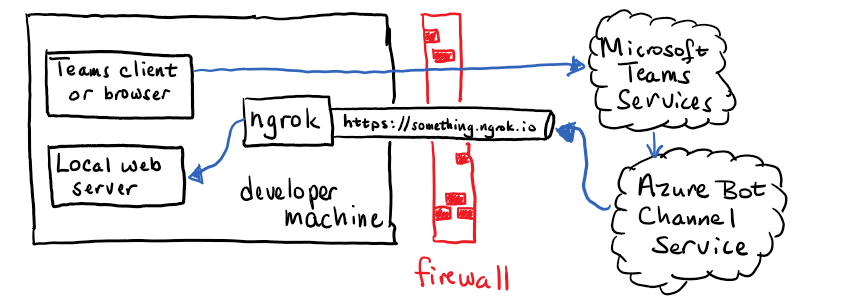

# Do I really need ngrok to build a Microsoft Teams application?

If you've started down the path of developing applications for Microsoft Teams, you may have seen a tool called [ngrok](https://www.ngrok.com) as a prerequisite in various tutorials and lab exercises. This is fine for many or most developers, and I count myself as a big fan of the tool! It gives some people heartburn, however, for a couple reasons:

* ngrok creates a tunnel from the public Internet to your local computer, which may be a security concern. A number of partners and customers I've worked with indicate that ngrok and similar tools have been prohibited in their organization for this reason.

* ngrok's free service provides a new URL every time it's run, or every 8 hours, whichever comes first. This generally means reconfiguring the application in some way when the URL changes. The alternative is to [pay for ngrok](https://ngrok.com/pricing); with the paid service you can reserve a public URL that won't change.

These issues have led quite a number of people to ask, "Do I really need ngrok?"

The consultant's favorite answer applies: "It depends."
My slightly more useful, short answer is, "Probably not, but it's likely the easiest option if you're ok with the issues above."

This article will explain, and help you determine if you need ngrok, or if you can't or would prefer not to use it, what options exist.

## What does ngrok do anyway (hint: it's more than just tunneling!)

Here are the features of ngrok that make it the darling of so many developers:

1. **Tunneling** - Of course the premier feature is tunneling. Typical firewalls or even home routers allow connections one way - that is, your computer behind the firewall can connect to computers on the Internet, but computers on the Internet can't initiate an inbound connection to your computer. 

    The tunnel creates a new IP address and hostname on the public Internet that will relay incoming connections through to your computer, thus bypassing any firewall that may be in place. For example if the Azure Bot Channel Service wants to send a message to a Teams bot you're debugging, it can't call directly, so ngrok saves the day.

1. **HTTPS Support** - Most modern web sites and web services require HTTPS and not HTTP, and for good reason! HTTPS provides privacy by encrypting the data between the client and server computers. Notably, the popular OAuth protocol used for authentication and authorization by Microsoft 365 and many other services isn't encrypted. A bad actor could steal an OAuth token from an HTTP message and use it as if they were the user (a so-called "man in the middle" attack.) To prevent this, HTTPS is considered a requirement for secure operation, and Microsoft 365 insists on it.

    Setting up TLS requires creating and installing a digital certificate which is used in generating the encryption key. You can avoid this by using ngrok, since HTTPS is built into the service. For example can tunnel from https://<something>.ngrok.io to http://localhost and avoid the setup.

1. **Name resolution** - The Domain Name Service (DNS) translates host names into IP addresses. This isn't a problem if your IP address is "127.0.0.1" (the local loopback address) since "localhost" is a widely known name for this address. But if you want to access your program from another computer the "localhost" option won't help. A good example is for testing your app from a mobile device; the device needs a way to access the service you're debugging on your computer.

    Again ngrok provides this with no extra effort. By translating localhost URLs into public ones such as https://<something>.ngrok.io, you can try test your app from a smart phone or tablet with no additional steps.

So while ngrok is clearly very useful, there are alternative approaches to handle each of these cases. The sections that follow will provide details.

> Many people have suggested other tunneling applications such as [Azure Relay](https://blog.botframework.com/2019/04/16/debugging-your-locally-hosted-v4-bot-using-azure-relays/) or [localtunnel](https://localtunnel.github.io/www/). While they may be helpful in some ways, they all open a tunnel from the public Internet to your development computer, and thus the same security concerns usually arise. This article will only consider approaches that do not expose any ports on the local computer to the public Internet.

## Debugging Teams tabs and task modules

Both tabs and task modules (modal dialogs) in Teams are web pages that appear in the Teams user interface. Teams requires https on the URL of these web pages. It's notable that the Teams client accesses these web pages directly, so as long as your Teams client or web browser can access the page with https, it will show up in Microsoft Teams.

This picture shows how ngrok works in the case of a tab or task module. The Teams client (or web browser) opens the web page via the ngrok tunnel, which sends the connection right back to the local computer.



If you think it looks pointless to have the call go out to the Internet and then right back in, you're right. However, remember that ngrok does more than tunneling! We are still benefitting from its other features.

| Feature | Needed for local tab debugging |
|---|---|
| Name resolution | yes |
| HTTPS encryption | yes |
| Tunneling | no |

So if not ngrok, how are we to handle name resolution and HTTPS encryption? Well actually there are many ways to do these things!

### 1. Simple but temporary: Force the browser to trust your page

If you can figure out how to turn on SSL in your web server, you can just access `localhost` via https. In the case of a NodeJS server, there is generally a **.env** file that contains a line like this:

```javascript
HTTPS=false
```

Guess what happens if you change it to true and then restart the web server? If you do, you'll be able to use https://localhost in your URL, which is perfectly acceptable to Microsoft Teams. However the certificate won't be trusted, and your browser will block the page. To deal with that, you need to first visit the page outside of Teams, get the security error, and instruct your browser to trust the certificate. Then Teams should allow you to access the page and your debugging can begin.

The downside of this is that it's temporary; the auto-generated certificates tend to expire after a month or so and one day you may wonder why your tab has disappeared. Though statistically unproven, this seems most likely to happen in a big demo of your application. So it works, but it's not ideal.

### 2. Better solution: Use your own TLS certificate

This is the preferred method. Basically you run a command line program to generate a new certificate, where you choose the expiration date. Then you install it on your local web server and trust it in your web browser, and you're all set. It's easy to reuse the same certificates on all your projects, reducing the extra work. Indeed, if you develop for the web, you probably already have a way to turn on HTTPS; just use whatever works! 

If you need to set up HTTPS on your development machine, [this article](https://bob1german.com/2020/10/17/setting-up-ssl-for-tabs-in-the-teams-toolkit-for-visual-studio-code/) may help. It was written for the Teams Toolkit, which uses Create React App for tabs, so if you use CRA you can just follow it.

If you use some other web server you can still follow the article above for making and trusting a certificate, it's just that you'll need to look up the instructions on how to install the certificate on your web server. Search for "Install TLS certificate" for your web server or development environment.

### 3. Don't host the site locally

Another approach is to move away from the strategy of local debugging entirely. For example, you could publish your app to Microsoft Azure app service and use the [remote debugger]. Here are the instructions for [Visual Studio Code (NodeJS)](https://code.visualstudio.com/docs/azure/remote-debugging) and 
[Visual Studio 2019 (.NET)](https://docs.microsoft.com/en-us/visualstudio/azure/vs-azure-tools-debug-cloud-services-virtual-machines).


### What about Teams Single Sign-on (SSO)?

It may seem that (no longer new) Teams SSO feature requires ngrok, but really it's no different than the non-SSO version. Here is an illustration.



As you can see, the ngrok tunnel is still leading right back to the local computer! The only difference is that now the local web server must make a request to Azure Active Directory. Since this is an outgoing request, no tunnel or other special handling is required.

## Building Teams bots and messaging extensions

Teams bots and messaging extensions are implemented as web services, not web pages. They are REST services and could be built with any tool chain, but the messages need to go through an [Azure Bot Channel](https://docs.microsoft.com/en-us/azure/bot-service/bot-service-manage-channels). This means that the Azure Bot Service is going to need to initiate connections to your local web server where you're debugging. To do that, you really do need some kind of tunnel.



For this reason there currently is no local debugging option in Microsoft Teams that doesn't involve some sort of tunnel, ngrok or otherwise. However there are still options available!

###1. Use the Bot Framework Emulator

The [Bot Framework Emulator]() allows you to run bots locally without any cloud connection at all. The drawback is that it doesn't currently understand some Teams-specific features such as messaging extensions. However it does a great job running conversational bots; adaptive cards work as well (though Invoke actions do not). 

If your bot isn't too Teams-specific, consider using the Bot Framework Emulator for most debugging and just do final integration in test in Teams, perhaps deployed in a staging envrionment (which must be able to accept incoming connections from the Azure Bot Service).

###2. Don't debug locally

Another approach is to move away from the strategy of local debugging entirely. For example, you could publish your app to Microsoft Azure app service and use the [remote debugger]. Here are the instructions for [Visual Studio Code (NodeJS)](https://code.visualstudio.com/docs/azure/remote-debugging) and 
[Visual Studio 2019 (.NET)](https://docs.microsoft.com/en-us/visualstudio/azure/vs-azure-tools-debug-cloud-services-virtual-machines).

You could also set up a development VM in Azure or your cloud service of choice and open an incoming port for the Azure Bot Service. Or just run ngrok - but away from the concerns of a corporate network.

## How many services do you have?

Teams applications generated by the [yo teams](https://docs.microsoft.com/en-us/microsoftteams/platform/tutorials/get-started-yeoman) generator have a single web server, so if your app has a combination of features - say, tabs and a bot - you can use one ngrok tunnel or one for all your application features.

Teams applications generated by the [Microsoft Teams Toolkit](https://docs.microsoft.com/en-us/microsoftteams/platform/toolkit/visual-studio-code-overview) generate multiple web servers, so if your application has a tab and a bot you'll end up with two services (three if you include tab SSO!). The easiest way to locally debug in this case is to run 2 (or 3) ngrok tunnels! However only the bot needs to accept external connections; the tab's web server and SSO web service can be set up for https and accessed locally.

## Mobile Device Testing

It's prudent to test Teams applications on the mobile clients (iOS and Android) to make sure everything looks right. ngrok makes this a breeze - since your local service is exposed on the public Internet, you can test using any device with an Internet connection.

If you're working on a bot or messaging extension, it has to go through the Azure Bot Service anyway so it doesn't matter where the Teams client is running.

If you're working on tabs, however, you may want a local debug option for mobile devices. This means moving away from `localhost` to a local DNS name. This requires a bit of networking know-how; the high-level steps are:

1. Ensure the test devices can reach your development computer directly via wifi (same subnetwork or corporate network, etc.)
1. Determine the local IP address of your development computer and open incoming ports that you're using for debugging (such as 3000 or 8080)
1. Come up with a hostname such as `server.local` and configure it with the local IP address on a local DNS server or on each client (remember **/etc/hosts**? It still works, and mobile devices have an app for that too!)
1. When you generate your self-signed TLS certificate, use your local hostname
1. Ensure each client under test trusts the self-signed TLS certificate

Or - just use ngrok! Exposing your services on the Internet really does make mobile device testing easier, and is the only option if you want to test over a cellular connection.

## Summary

No you don't need ngrok - you just need to make your application accessible by Teams. Depending on your situation, the strategies in this article can allow you to debug your Teams applications without tunneling. But a tool like ngrok can sure make life easier!
