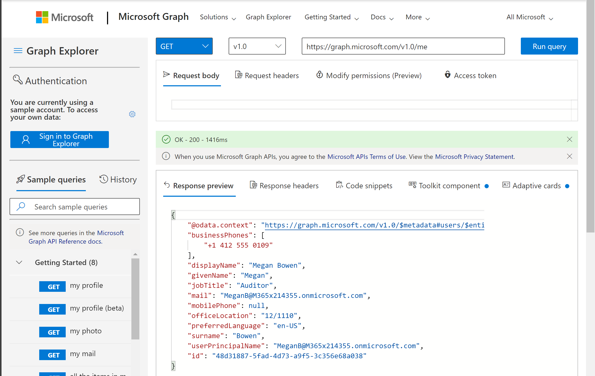

# Using APIs on the Internet

Think about all the applications you used today that somehow involved the Internet. Be sure to include the apps you used on your phone as well as on your computer, especially any that involve the cloud. And don't forget the ones you accessed via a web browser.

All those applications have a user interface, right? Yet the UI is only the tip of the iceberg!

Most modern applications have another interface: an Application Programming Interface or API that's used when a computer program rather than a human user wants to talk to the application. 

In the last fifteen years or so there's been an explosion of APIs that work over the Internet following a style called "REST" or "RESTful web services", and this article will explain how to use them.

The actual meaning of "REST" is left for the last section since it's kind of academic; feel free to skip it!

## Why learn to call REST services?

Learning how to call these services allows access to thousands of services from your Power Apps, Power Automate flows, Single-Page Apps, SharePoint Framework web parts, Azure Logic Apps, shell and Power Shell scripts, C# and NodeJS programs, and more. Pretty much any modern method of programming a computer includes the ability to call REST services and connect to the vast universe of APIs on the Internet.

Here are some examples of REST services to give you an idea of what's possible.

| Service | Description |
|--|--|
| [Microsoft Graph](https://docs.microsoft.com/en-us/graph/overview) | The primary API for Microsoft 365 including Teams, Planner, Azure AD, and the most commonly used features in SharePoint and Exchange online |
| [Amazon](https://developer.amazon.com/) | From Alexa to videos, Amazon has APIs for a myriad of services |
| [Bing Maps APIs](https://www.microsoft.com/en-us/maps/choose-your-bing-maps-api) | A suite of mapping APIs including REST services |
| [Ebay](https://developer.ebay.com/docs) | One of the very first REST APIs, EBay provides access to their extensive ecommerce services |
| [Facebook API](https://developers.facebook.com/docs/apis-and-sdks) | Access to Facebook services |
| [Github API](https://docs.github.com/en/rest) | Most Github operations are available via these APIs |
| [Google APIs](https://developers.google.com/apis-explorer/) | Dozens of APIs from ads to YouTube |
| [Open Weather API](https://openweathermap.org/api) | Weather conditions and forecasts |
| [Twitter API](https://developer.twitter.com/en/docs/twitter-api) | Access to Twitter services |

Want more? Here are some compilations of popular APIs:

* [API List](https://apilist.fun/)
* [Github's collection of public APIs](https://github.com/public-apis/public-apis/blob/master/README.md)
* [Top 50 APIs from Computer Science Zone](https://www.computersciencezone.org/50-most-useful-apis-for-developers/#:~:text=%2050%20Most%20Useful%20APIs%20for%20Developers%20,The%20ability%20to%20log%20into%20a...%20More)

## How do REST APIs work?

REST APIs piggyback on the HTTP/HTTPS protocol, the same one used to browse the web. Surely you've typed http about a million times by now, so you're already in practice! Generally the secure option, HTTPS, is used, but this article will generally say HTTP for brevity.

There are a number of practical advantages to using HTTP, including:

* Because web pages are so widely used, almost every programming environment can deal with HTTP. 
* There is a lot of networking infrastructure already in place to deal with HTTP; by using HTTP, REST calls can work over all of it.
* Traditional corporate networks block most protocols but nearly always have a provision for outgoing HTTP calls so users can access the world wide web. If a browser works, REST calls will generally work too, so they're ideal for use on these corporate networks.

And so this article is mostly about HTTP!

## Anatomy of an HTTP request

The HTTP protocol consists of _requests_ and _responses_; if you're using a public API, you'll generally be sending the _requests_ and recieving _responses_.

Each HTTP request and response has:

* A URL or _Uniform Resource Locator_ - Just like the URL in a web browser except instead of a web page, it indicates the resource you want to act on within the API.
* An HTTP _verb_ - Each request includes a verb specifying what you want to do with the resource identified by the URL. For example to get a web page, use the GET verb.
* A _header_ - This is information about the request itself, such as the format of data in the _body_ portion. The header conatins name-value pairs called "fields".
* A _body_ - Some requests and responses include a body for data; for example the response to a GET request for a web page includes a _body_ containing the HTML for the web page. APIs generally use [JSON](https://techcommunity.microsoft.com/t5/microsoft-365-pnp-blog/introduction-to-json/ba-p/2049369) instead, which allows data instead of hypertext to be sent and recieved.

Responses also include a _status code_ and _message_ indicating if the request was successful, or if special actions (such as redirecting to a different URL) are needed.

When you browse the web, your web browser takes care of all this. When you make a REST call, you will see all the gory details in whatever tool you're using. This is both the good and bad of REST: it's not ideal that you have to see the plumbing behind each call, but it's great that the plumbing is so universal that it works almost anywhere.

In general, you should expect to see all of parts of the HTTP request - URL, verb, headers, and body, explained for each available request in the API's documentation. At its simplest, all you have to do is copy the URL, verb, header fields and body into your tool of choice, filling in any values that are specific to your call, and tell it to send the request.

The sections that follow will provide more details on each part of an HTTP request, but first let's play!

### Time to Play

It turns out that the Microsoft Graph team provides an excellent tool for experimenting with REST (and the Microsoft Graph); it's called the [Graph Explorer](https://developer.microsoft.com/en-us/graph/graph-explorer). It's just a web page; check it out!

[Add callouts and relate to the above]

