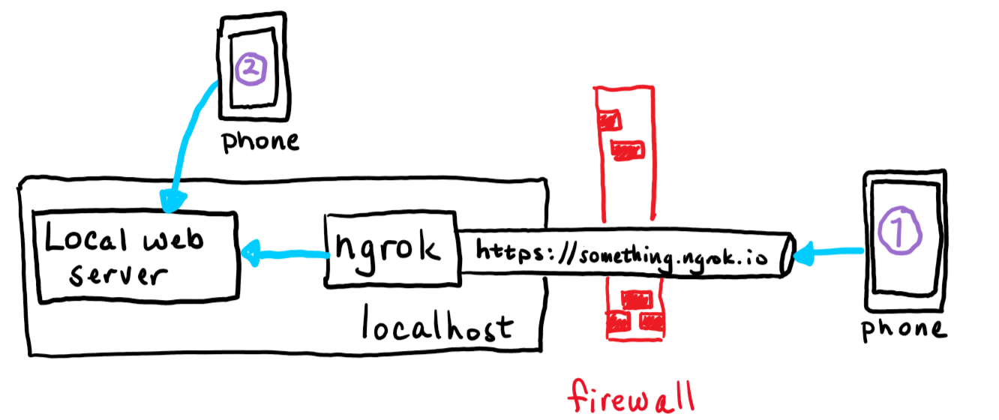

# What is ngrok and do I really need it for Microsoft Teams development?

If you've started down the path of developing applications for Microsoft Teams, you may have seen a tool called [ngrok](https://www.ngrok.com) as a prerequisite in various tutorials and lab exercises. It's also integrated with a number of tools such as the [Microsoft Teams Toolkit](#), and the [yo teams](#) generator; even the [Bot Framework Emulator](#) has an ngrok option.

This article will explain what ngrok is, why it's useful, and what to do instead if you or your company are uncomfortable with using it.

## Grokking ngrok

As you may already be aware, Microsoft Teams applications don't run in Teams. Tabs are implemented as web pages that can run anywhere on the Internet; Bots are web services that communicate with Teams via the Azure Bot Service. Other app features, such as task modules (dialog boxes) and messaging extensions, use the same mechanisms.

It's very handy to use ngrok when debugging these applications on your local computer. Here's why:

1. ngrok provides the encryption needed for https, which is required for Teams applications. It's set up using a trusted TLS certificate so it just works immediately in any web browser.

1. ngrok provides a tunnel from the Internet to your local computer which can accept incoming connections that are normally blocked by an Internet firewall. The requests in this case come from the Azure Bot Service over the public Internet. Though tunneling is not required per se, there has to be some way for the Azure Bot Service to send requests to the application. 

1. ngrok provides name resolution with a DNS name ending in `ngrok.io`, so it's easy to find the public side of the Internet tunnel.

1. ngrok makes mobile device testing easier since any Internet-connected phone or tablet can reach your app via the tunnel. There's no need to mess with the the phone's network connections, it just works.

These conveniences have made ngrok the darling of many Microsoft Teams developers. It lets them compile, run, and debug software locally without worrying about any of this.

The tunneling part, however, scares many IT professionals, especially if they're managing a traditional corporate network that relies on a shared firewall or proxy server for security. While ngrok only provides access to the local computer where it's run, an insider "bad actor" could launch attacks from such a machine. For that reason, some IT departments block ngrok.

> Many colleagues have suggested other tunneling applications such as [Azure Relay](https://blog.botframework.com/2019/04/16/debugging-your-locally-hosted-v4-bot-using-azure-relays/) or [localtunnel](https://localtunnel.github.io/www/). While they may do the job, they still open a tunnel from the public Internet to your development computer, and thus the same security concerns usually arise. This article will only consider approaches that don't expose any local ports on the Internet.

## Tunneling explained

Most computers that are connected to the Internet aren't connected directly. Network traffic passes through some kind of firewall or NAT router to reach the actual Internet. That means the computer can make outgoing requests to servers on the Internet, but the firewall blocks incoming requests. This is largely a security measure, but it has other advantages as well.

A typical web developer runs some kind of web server on their local computer. They can access that web server using the hostname `localhost`, which routes messages through a "loopback" service instead of sending them out on the network. 

This works fine so long as the application only needs to get requests from the local  computer. Teams tabs and task modules are loaded directly from the web server, so there's no need for a tunnel when testing with a local Teams client or web browser.

There are situations, however, when a service on the Internet needs to call the application - a call that is normally blocked by the firewall. Bots and messaging extensions are examples of this since incoming messages (called "activities") originate on the Internet. Web hooks, in which an application subscribes to receive requests from a service on the Internet, have the same challenge. If you've ever opened a port on your home router to allow a game to receive incoming connections, this is the same situation.

With ngrok running, the incoming requests go through the ngrok service and into your locally running copy of the ngrok application. This allows the developer to use their local tools just as before.

In the case of Teams development, tabs and task modules only require local loopback connection, whereas bots and messaging extensions have to handle incoming requests from the Internet. The sections which follow examine each of these scenarios.

## Developing Tabs and Task Modules

Application tabs and task modules are ordinary web pages that are displayed in an IFrame within the Microsoft Teams user interface. Applications using the Azure Active Directory Single Sign-On (SSO) option also needs to implement a web service. Accessing these via `localhost` is no problem; no tunnel is required. 

However Teams does require a trusted https connection or it won't display them. ngrok translates trusted https requests into local http requests, so it just works. But if you'd rather not have a tunnel to the Internet as part of your setup, you can do this all locally, it's just more work.

### Setting up a trusted https server

On a NodeJS server, you can usually enable https by editing the **.env** file and setting the `HTTPS` property to true. For .NET projects in Visual Studio, under project properties on the "Debug" tab, check the "Enable SSL" box to enable https.

But alas, just turning on the https protocol is generally not enough to satisfy this requirement; the connection must be trusted. Trust is established by a digital certificate; if the certificate is up-to-date and matches the hostname in the URL, the little padlock in your web browser lights up and all is well. If not, you get errors that you can bypass in most web browsers, but not in Microsoft Teams.

The people over at ngrok have acquired a trusted certificate for any hostname ending in `ngrok.io`; hence it just works like most any public web site. The local web server, on the other hand, will most likely have a locally-generated, untrusted certificate. So the trick is to get your browser and/or Microsoft Teams to trust it.

An option that sometimes works is to browse to the local server from a regular web browser, click the security error, and tell the browser to trust the certificate. If the browser and Microsoft Teams share the same certificate store, this will work for a while, but these default certificates generally expire after a month or so, so the process will need to be repeated.

A better option is to generate your own certificate and tell your computer to trust it. That way you can control the expiration date and reuse the certificate on multiple projects, so you only need to do the setup once. This is explained in the article, [Setting up SSL for tabs in the Teams Toolkit for Visual Studio Code](https://bob1german.com/2020/10/17/setting-up-ssl-for-tabs-in-the-teams-toolkit-for-visual-studio-code/). The instructions are for a [Create React App](#) aplication using the Teams Toolkit but they shouldn't be too difficult to adapt to other tool chains since the certificate creation and trust parts are the same regardless.

### Mobile device testing

It's prudent to test Teams applications on the mobile clients (iOS and Android) to make sure everything looks right. ngrok makes this a breeze - since your local service is exposed on the public Internet, you can test using any device with an Internet connection.

It's possible to test mobile devices locally by putting them on a local network that can directly reach the developer's computer. This picture shows two phones, one connected locally and one using ngrok.

To set up local access, you'll need a server name other than `localhost`, and to , as your phone will do the same loopback trick as your computer. So you'll need to:

1. Connect your mobile device via wifi to the same network as your development computer.
1. Open an incoming port on your development computer's built-in firewall, generally port 3000 or 8080 or whatever your local web server is using.
1. Ideally, reserve a local IP address for your development computer so it won't change over time. This can be accomplished in the DHCP section of most home routers or by using a fixed IP address.
1. Set up a `hosts` entry (phones have them too!) or local DNS name to point to your development computer. Again, most home routers have the ability to register a local DNS name so you don't have to configure it in each device.
1. Make sure the https certificate is for this same hostname, and install as a trusted certificate on your phone.

While this might not seem easy, it is possible! And once it's set up you can use it every day. Or - just use ngrok.

## Developing Bots and Messaging Extensions

Teams bots and messaging extensions are implemented as web services, not web pages. They are REST services and could be built with any tool chain, but the messages need to go through an [Azure Bot Channel](https://docs.microsoft.com/en-us/azure/bot-service/bot-service-manage-channels). This means that the Azure Bot Service is going to need to initiate connections to your local web server where you're debugging.

For this reason there's currently no local debugging option in Microsoft Teams that doesn't involve opening a port on the Internet or using some sort of tunnel, ngrok or otherwise. However there are still options available!

### 1. Use the Bot Framework Emulator

The [Bot Framework Emulator]() allows you to run bots locally without any cloud connection at all. The drawback is that it doesn't currently understand some Teams-specific features such as messaging extensions. However it does a great job running conversational bots; adaptive cards work as well (though Invoke actions do not). 

If your bot isn't too Teams-specific, consider using the Bot Framework Emulator for most debugging and just do final integration in test in Teams, perhaps deployed in a staging envrionment (which must be able to accept incoming connections from the Azure Bot Service).

### 2. Don't debug locally

Another approach is to move away from the strategy of local debugging entirely. For example, you could publish your app to Microsoft Azure app service and use the remote debugger. Here are the instructions for [Visual Studio Code (NodeJS)](https://code.visualstudio.com/docs/azure/remote-debugging) and 
[Visual Studio 2019 (.NET)](https://docs.microsoft.com/en-us/visualstudio/azure/vs-azure-tools-debug-cloud-services-virtual-machines).

You could even set up a development VM in Azure or your cloud service of choice and open an incoming port for the Azure Bot Service. Or just run ngrok in the VM, away from the concerns of a corporate network.

## How many services do you have?

Teams applications generated by the [yo teams](https://docs.microsoft.com/en-us/microsoftteams/platform/tutorials/get-started-yeoman) generator have a single web server, so if your app has a combination of features - say, tabs and a bot - you can use one ngrok tunnel or one for all your application features.

Teams applications generated by the [Microsoft Teams Toolkit](https://docs.microsoft.com/en-us/microsoftteams/platform/toolkit/visual-studio-code-overview) generate multiple web servers, so if your application has a tab and a bot you'll end up with two services (three if you include tab SSO!). The easiest way to locally debug in this case is to run 2 (or 3) ngrok tunnels! However only the bot needs to accept external connections; the tab's web server and SSO web service can be set up for https and accessed locally.

## Summary

While ngrok isn't a requirement for Teams development, it does make it a lot easier. However if you can't or don't want to open up a tunnel from the Internet, there are other strategies. Many of these - local https servers, trusting self-signed certificates, and local host names - have been around for a long time.

There is nothing magic about Teams development! It was designed to use standard web tooling, and you can use the same networking setup that you'd use for any web development project. Just be aware of what services will be called from the Internet and plan accordingly.

